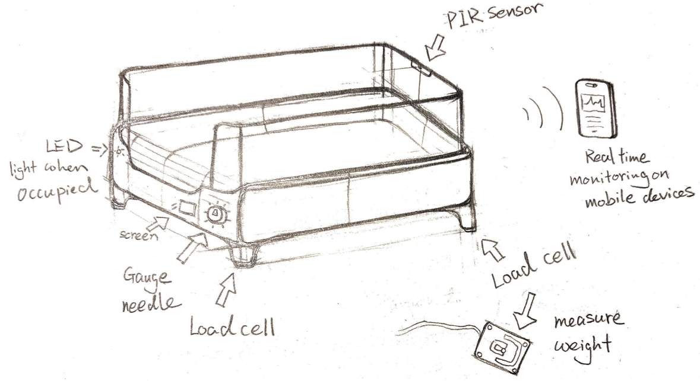
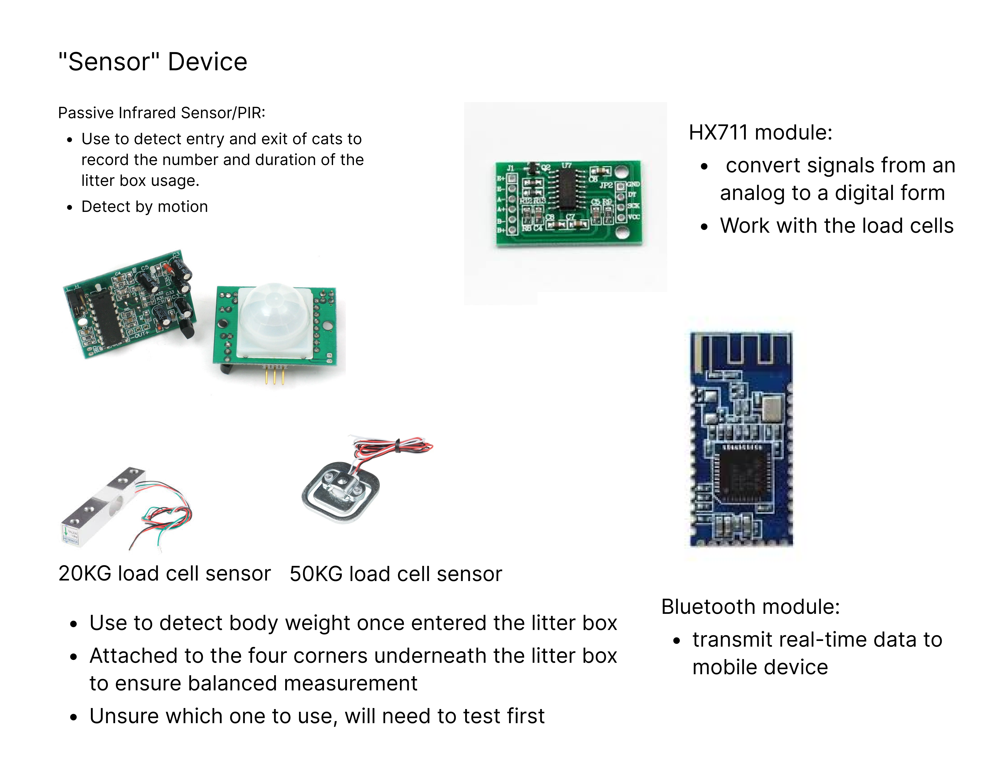
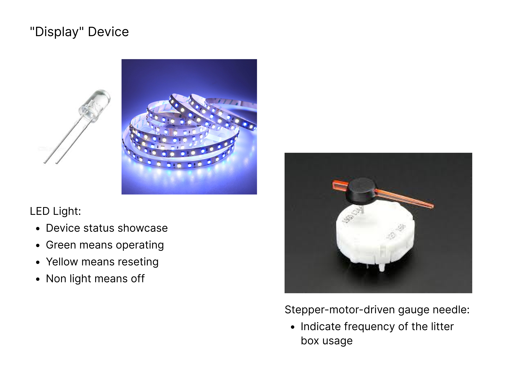
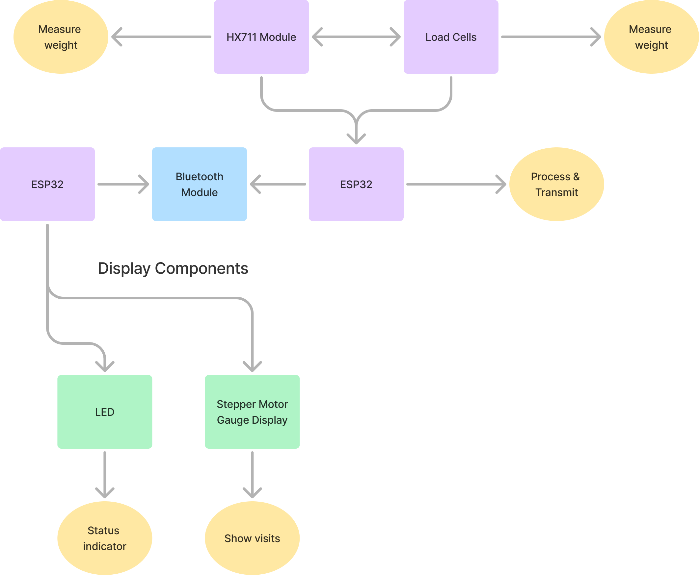

# TECHIN-514 Smart Litter Box Project

# Background
My cat was recently diagnosed with diabetes, so I have to closely monitor her weight and urination frequency. According to my vet, diabetic cats should typically urinate between 2-4 times per day, and anything more than that could indicate poor blood sugar control or other health issues. Other than that, weight management is also essential, so I have to keep daily records of her to prevent unexpected changes in advance. However, cats tend to have an unpredictable litter box routine, which became a big challenge for students like me who must go to school every day. 

# Project Overview
This is a smart litter box designed for cats with diabetes. It aims to help owners closely monitor their cats' weight changes and urination frequency with a PIR sensor and Load cells. With Bluetooth transmission support, owners can access real-time data anytime through their phone. 

# Sensors Device

# Display Device

# Detailed Diagram
