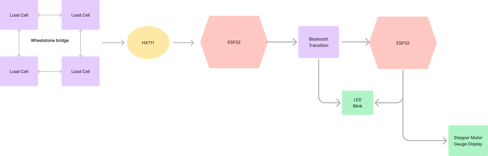

# TECHIN-514 Smart Litter Box Project

# Background
My cat was recently diagnosed with diabetes, so I have to closely monitor her weight and urination frequency. According to my vet, diabetic cats should typically urinate between 2-4 times per day, and anything more than that could indicate poor blood sugar control or other health issues. Other than that, weight management is also essential, so I have to keep daily records of her to prevent unexpected changes in advance. However, cats tend to have an unpredictable litter box routine, which became a big challenge for students like me who must go to school every day. 

# Proposed Solution
This is a smart litter box designed for cats with diabetes. It aims to help owners closely monitor their cats' weight changes and urination frequency. With Bluetooth transmission support, owners can access real-time data anytime through cloud database.

# Desired Features
HX711 and 4 Load Cells to measure weight changes and detect urination frequency.
2 Xiao Esp32C3 to transmit data wirelessly via Bluetooth
A stepper motor-driven gauge displays daily urination frequency once it receives data.
Runs on a battery-efficient system optimized for long-term operation.

# System Communication Diagram
This System Communication Diagram shows how the load cells detect weight, the HX711 amplifies the signal, and the Sensor ESP32 processes and sends data via Bluetooth to the Display ESP32, which controls the gauge display and LED indicator for real-time feedback.

# Detailed Diagram
This System Diagram represents the Smart Litter Box for Diabetic Cats. The load cells measure weight, and the HX711 module amplifies and converts the signal. The Sensor ESP32 processes the data and transmits it via Bluetooth to the Display ESP32, which controls the stepper motor gauge display to show visits and the LED as a status indicator.

# Critical Components & PCB

